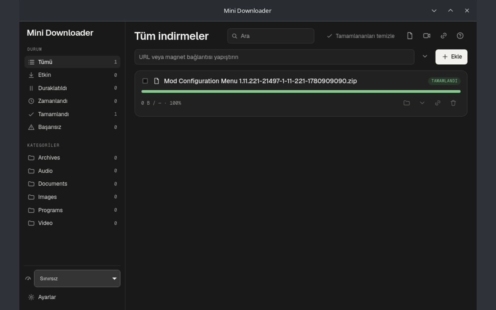

# Mini Downloader

[](https://github.com/RamazanBerk20/mini-downloader/actions/workflows/build.yml)
[](https://github.com/RamazanBerk20/mini-downloader/releases)
[](LICENSE)
[](https://github.com/sponsors/RamazanBerk20)

An IDM/JDownloader-style download manager for **Linux and Windows**, built with
Rust + Tauri. aria2 does the heavy lifting (multi-connection segmented
downloads, torrents, metalinks), yt-dlp grabs video (HLS/DASH, YouTube and
friends), and a browser extension captures downloads straight from Firefox and
Chromium — cookies, referer and all.



## Features

- **Multi-connection downloads** — up to 16 segments / 16 connections per
  server via aria2, with pause/resume, per-download and global speed limits,
  and optional SHA-256 verification on completion
- **Browser capture** — Firefox & Chromium extension hands downloads (with
  cookies/referer/user-agent) to the app through native messaging, with a
  file-type blacklist and a "leave magnets to the system" mode for handing
  types back to the browser or your torrent client
- **Video grabbing** — yt-dlp integration: probe formats, pick quality, mux
  with ffmpeg; **playlists** with an entry picker, subtitles, audio extraction
  (mp3/m4a/opus), thumbnail embedding; in-page media sniffing (HLS/DASH)
- **Torrents & magnets** — aria2's BitTorrent engine + magnet deep links,
  per-torrent **file selection**, and a detail panel with per-file progress,
  peers and pieces
- **Packages** — batch adds, playlists and bulk browser captures group into
  collapsible packages with aggregate progress and group actions
- **Link grabber** — paste text/HTML, extract and batch-add links (with
  numeric-range expansion like `file[001-050].jpg`)
- **Scheduling** — pause/resume-all or speed-limit rules per weekday/time,
  plus "start this download at…" for individual downloads
- **Categories** — auto-organize finished files (Archives, Audio, Video, …)
  into localized user folders by extension, MIME type or source host, with
  per-category priority
- **Network controls** — proxy (HTTP/SOCKS), BitTorrent DHT toggle, optional
  Landlock sandboxing of helper processes, private-address blocking
- **Clipboard watcher**, system tray, autostart, desktop notifications,
  on-complete actions (quit/sleep/shutdown/custom command)
- **10 languages** — English, Türkçe, Español, Français, Deutsch, Русский,
  العربية (RTL), 中文, 日本語, 한국어 — in the app *and* the extension
  (which can also override the browser language)
- Warm-monochrome minimal UI with full keyboard navigation and screen-reader
  support

## Install

### Linux

Grab from [Releases](https://github.com/RamazanBerk20/mini-downloader/releases):

- **Debian/Ubuntu**: `sudo apt install ./Mini.Downloader_*_amd64.deb`
- **Fedora/openSUSE**: `sudo rpm -i Mini.Downloader-*.x86_64.rpm`
- **AppImage**: `chmod +x Mini*Downloader*.AppImage && ./Mini*Downloader*.AppImage`
  (needs `aria2` installed; `yt-dlp` + `ffmpeg` for video)

deb/rpm depend on your distro's `aria2` + `ffmpeg` and recommend `yt-dlp`.

- **Arch (AUR)**: `paru -S mini-downloader-bin` (or `mini-downloader` to build
  from source) — see `packaging/aur/`

### Windows

Download the NSIS `.exe` installer (or `.msi`) from
[Releases](https://github.com/RamazanBerk20/mini-downloader/releases). aria2
and yt-dlp are bundled; install [ffmpeg](https://ffmpeg.org/download.html) and
put it on `PATH` if you want video muxing.

### Browser extension

Once published to the stores, install in one click from **Firefox Add-ons** /
the **Chrome Web Store** (buttons appear in Settings → Browser integration).
Until then, load it manually:

1. Download `mini-downloader-firefox-*.zip` / `mini-downloader-chrome-*.zip`
   from Releases (or build with `./scripts/build-extension.sh`).
2. **Firefox**: `about:debugging` → This Firefox → Load Temporary Add-on →
   pick `manifest.json` from the unzipped folder. For a *permanent* add-on,
   install the signed `.xpi` from the release if present (see
   `scripts/EXTENSION-PUBLISHING.md`).
   **Chromium/Chrome/Edge/Brave**: `chrome://extensions` → Developer mode →
   Load unpacked → the unzipped folder.
3. Start the app once — it registers the native-messaging host for every
   detected browser automatically (Settings → "Install native-messaging host"
   re-runs it).

## Build from source

```sh
# deps: rust, nodejs >= 22, pnpm, aria2, ffmpeg, yt-dlp, webkit2gtk-4.1 (Linux)
git clone https://github.com/RamazanBerk20/mini-downloader
cd mini-downloader/apps/desktop
pnpm install
pnpm tauri dev            # development
pnpm tauri build          # release bundles for your platform
```

`scripts/install-arch.sh` installs everything needed on Arch/CachyOS.
`docker compose run --rm build` produces Linux bundles reproducibly (Ubuntu
22.04 glibc floor).

## Architecture

```
extension (Firefox/Chromium MV3)
   └─ native messaging (stdio) ─ minidl-native-host
        └─ local socket (UDS / named pipe) ─ minidl-desktop (Tauri + Svelte 5)
             ├─ minidl-core: aria2 JSON-RPC engine, SQLite, categories, i18n
             ├─ aria2c subprocess (segmented HTTP, BitTorrent, metalink)
             └─ yt-dlp subprocess (HLS/DASH probe + download, ffmpeg mux)
```

## Sponsor

If Mini Downloader is useful to you, consider
[sponsoring development ❤](https://github.com/sponsors/RamazanBerk20).

## License

GPL-3.0-or-later. Bundles/uses [aria2](https://aria2.github.io/) (GPLv2),
[yt-dlp](https://github.com/yt-dlp/yt-dlp) (Unlicense) and
[ffmpeg](https://ffmpeg.org/) (LGPL/GPL).
