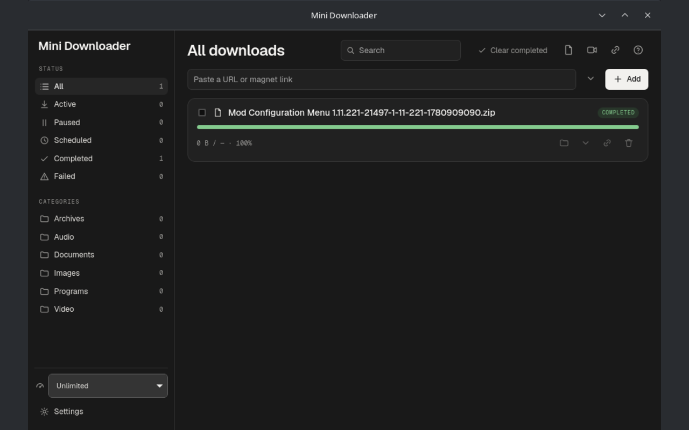

# Mini Downloader

[](https://github.com/RamazanBerk20/mini-downloader/actions/workflows/build.yml)
[](https://github.com/RamazanBerk20/mini-downloader/releases)
[](LICENSE)
[](https://github.com/sponsors/RamazanBerk20)

An open-source, local-first download manager for **Linux and Windows**. Mini
Downloader combines aria2's reliable multi-connection engine with yt-dlp media
tools and an optional browser connector, in a keyboard-friendly Tauri + Svelte
desktop app.



## Get Mini Downloader

Download the current package from [GitHub Releases](https://github.com/RamazanBerk20/mini-downloader/releases/latest).

### Linux

- **Debian/Ubuntu:** `sudo apt install ./Mini.Downloader_*_amd64.deb`
- **Fedora:** `sudo dnf install ./Mini.Downloader-*.x86_64.rpm`
- **openSUSE:** `sudo zypper install ./Mini.Downloader-*.x86_64.rpm`
- **AppImage:** `chmod +x Mini*Downloader*.AppImage && ./Mini*Downloader*.AppImage`

The `.deb` and `.rpm` packages use the distro's `aria2` and `ffmpeg`, and
recommend `yt-dlp`. The AppImage needs `aria2` on the host; install `yt-dlp`
and `ffmpeg` as well for media downloads and muxing.

On Arch-based distributions, install an AUR package:

- [`mini-downloader-bin`](https://aur.archlinux.org/packages/mini-downloader-bin) — prebuilt release
- [`mini-downloader`](https://aur.archlinux.org/packages/mini-downloader) — build the release source
- [`mini-downloader-git`](https://aur.archlinux.org/packages/mini-downloader-git) — latest `main`

### Windows

Use the NSIS `.exe` installer or `.msi` from
[GitHub Releases](https://github.com/RamazanBerk20/mini-downloader/releases/latest).
aria2 and yt-dlp are bundled. Install
[ffmpeg](https://ffmpeg.org/download.html) and add it to `PATH` if you want
video muxing.

## Browser connector

The optional connector sends browser downloads to the local app with the URL,
cookies, referer, and user agent needed for authenticated downloads. It also
offers page-media capture for HLS/DASH streams.

| Browser family | Install from |
| --- | --- |
| Firefox and Firefox-based browsers | [Firefox Add-ons](https://addons.mozilla.org/firefox/addon/mini-downloader-connector/) |
| Chrome, Chromium, Edge, Brave, and compatible Chromium browsers | [Chrome Web Store](https://chromewebstore.google.com/detail/mini-downloader-connector/hhaobmkdgijodfieadeeanjmnneckafj) |

Install it through the browser's own confirmation flow; desktop apps cannot
silently add extensions to Firefox or Chromium. Settings → **Extensions**
opens the applicable store and shows which supported browser profiles were
found. The non-blocking in-app reminder disappears once a connector is
confirmed. If a connector is already installed, opening that browser confirms
the live bridge for the session.

For local extension development:

```sh
./scripts/build-extension.sh
```

Load `dist-ext/firefox/manifest.json` from `about:debugging` in Firefox, or
load `dist-ext/chrome/` as an unpacked extension from `chrome://extensions` in
Chromium-based browsers. Start the app once to register its local
native-messaging host for supported profiles.

## What it does

- **Download reliably:** segmented HTTP(S)/FTP downloads, pause/resume, speed
  limits, SHA-256 verification, torrents, magnets, and metalinks. Interrupted
  work remains resumable, while restored downloads stay paused at startup until
  you choose to continue them.
- **Capture and grab media:** browser capture preserves request context;
  yt-dlp supports formats, playlists, subtitles, audio extraction, thumbnails,
  and HLS/DASH media.
- **Keep work organized:** packages, bulk link grabbing with numeric ranges,
  per-download scheduling, category rules, and automatic file organization.
- **Stay in control:** proxy support, BitTorrent DHT control, optional helper
  sandboxing, private/local-address blocking, clipboard watching, tray and
  autostart integration, notifications, and completion actions.
- **Use it comfortably:** full keyboard navigation, screen-reader support, and
  ten interface languages, including RTL Arabic, across the desktop app and
  connector.

## Develop from source

You need Rust stable, Node.js 22, pnpm 11, Git, and the platform prerequisites
for [Tauri v2](https://v2.tauri.app/start/prerequisites/).

On Debian/Ubuntu, the core Linux build and runtime dependencies are:

```sh
sudo apt-get update
sudo apt-get install -y \
  build-essential pkg-config libwebkit2gtk-4.1-dev libappindicator3-dev \
  librsvg2-dev libssl-dev libxdo-dev patchelf aria2 ffmpeg yt-dlp
```

Then clone, install, and run the same essential checks used by CI:

```sh
git clone https://github.com/RamazanBerk20/mini-downloader.git
cd mini-downloader
pnpm --dir apps/desktop install --frozen-lockfile
cargo test --workspace
pnpm --dir apps/desktop check
pnpm --dir apps/desktop tauri dev
```

`pnpm --dir apps/desktop tauri build --no-bundle` smoke-builds the application.
For Linux packages, build the native-messaging sidecar first:

```sh
cargo build --release -p minidl-native-host
pnpm --dir apps/desktop tauri build
```

For Arch/CachyOS setup, inspect and use
[`scripts/install-arch.sh`](scripts/install-arch.sh). It intentionally makes
system and Git-configuration changes, so review it before running it.

### Dev Container and Docker

The repository includes a VS Code Dev Container in
[`.devcontainer/devcontainer.json`](.devcontainer/devcontainer.json). It reuses
the Ubuntu 22.04 Docker image and provides Rust stable, Node 22, pnpm 11, Tauri
Linux dependencies, aria2, ffmpeg, and yt-dlp.

1. Install Docker and the
   [Dev Containers](https://marketplace.visualstudio.com/items?itemName=ms-vscode-remote.remote-containers)
   extension. Install the Docker Compose plugin as well if you plan to use the
   Compose commands below.
2. Open this repository in VS Code.
3. Run **Dev Containers: Reopen in Container**. Dependencies are installed from
   the lockfile when the container is created.

The container keeps its `node_modules` in a Docker volume, separate from the
host checkout, so switching between host and container tooling does not mix
their dependency metadata.

The Dev Container is designed for Linux checks and bundle builds. A visible
Tauri window needs explicit host-display forwarding, and browser native
messaging must be tested on the host because browser profiles and host-manifest
paths belong to that machine. For a Linux/XWayland development shell, the
existing Compose service is available after configuring host display access:

```sh
docker compose run --rm dev
```

`docker compose run --rm build` performs the headless Linux package build in
the same Ubuntu 22.04 image. It is a consistent local build environment, not a
replacement for release CI or host-browser integration testing.

## Architecture

```text
extension (Firefox/Chromium MV3)
   └─ native messaging (stdio) ─ minidl-native-host
        └─ local socket (UDS / named pipe) ─ minidl-desktop (Tauri + Svelte 5)
             ├─ minidl-core: aria2 JSON-RPC engine, SQLite, categories, i18n
             ├─ aria2c subprocess (segmented HTTP, BitTorrent, metalink)
             └─ yt-dlp subprocess (HLS/DASH probe + download, ffmpeg mux)
```

## Privacy, support, and license

The connector sends capture data only to the Mini Downloader app on your own
computer; it does not include analytics or remote code. See the
[privacy policy](PRIVACY.md) for the details.

Report a bug or request a feature through
[GitHub Issues](https://github.com/RamazanBerk20/mini-downloader/issues). If
the app is useful to you, you can [sponsor development](https://github.com/sponsors/RamazanBerk20).

Mini Downloader is licensed under [GPL-3.0-or-later](LICENSE). It bundles or
uses [aria2](https://aria2.github.io/) (GPLv2),
[yt-dlp](https://github.com/yt-dlp/yt-dlp) (Unlicense), and
[ffmpeg](https://ffmpeg.org/) (LGPL/GPL).
